As we are interested in digital images, we concentrate on Discrete Fourier Transform (DFT). It can be used in a broad range of applications such as filtering, image restoration, compression and analysis etc.

The DFT does not contain all the frequencies which forms the image but only some samples which are sufficient to represent the information in spatial domain image. Given an image f[m,n] of size MxN, the mathematical expressions for DFT and inverse DFT (IDFT) are given below.

DFT: 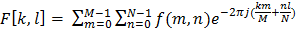 (1)

IDFT: 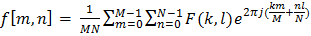(2)

The Eq(1) can be interpreted as the value of F[k,l] at each point is  obtained by multiplying the spatial image with the corresponding exponential function (base function) followed by summation. Basis functions are pure sinusoidals with increasing frequency. In Eq(2), 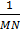term is corresponds to normalization constant.

The output of FT of an image is complex valued image which can be displayed by two images: magnitude and phase. Often only the magnitude of FT is displayed because it consists of the most of the information about the geometric structure of the image in spatial domain.

It is very easy to examine or process certain frequencies of the image in Fourier domain, it influences the geometric structure in the spatial domain.

In general, the FT image is shifted in such a way that the DC-value (i.e. the image mean) F[0,0] is displayed in the center of the image. The distance from the center is proportional to its corresponding frequency.

As an example, here we show the spatial (left) and frequency (right) domain representations of lena image.

 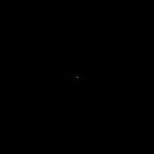

The image shown on right is the magnitude calculated from the complex result of Fourier transform. The DC value (F[0,0]) is can be represented by brightest spot of the image. However, the dynamic range of the Fourier coefficients (i.e. the intensity values in the Fourier image) is too large to be displayed on the screen, therefore all other values appear as black. If we apply a logarithmic compression to the image, we get

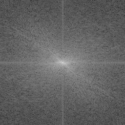

The above image contains components of all frequencies, but their magnitude gets smaller for higher frequencies. Hence, low frequencies contain more image information than the higher ones. The transform image also tells us that there are two dominating directions in the Fourier image, one passing vertically and one horizontally through the center.

The phase spectrum of the FT of lena image is as shown in below

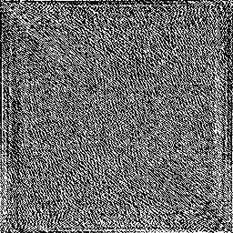

The value at each pixel represents to the phase of corresponding frequency. If we apply IDFT on magnitude spectrum while ignoring the phase, we get

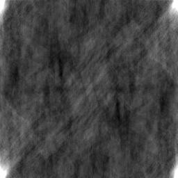

Although above image contains all the frequencies same as the original lena image, it is corrupted. This shows that phase spectrum plays very crucial role in image reconstruction. The phase spectrum in an audio or image signal contains very important information and any manipulation here can destroy the identity of the signal. This is why, people don't touch it in filtering or go for linear phase filtering.

**Some familiar images and their Fourier transforms:**

The 2D Fourier transform represents the image as a summation of sinusoidal functions (basis functions). Hence, Fourier transform (FT) of pure sinusoidal images are as simple as follows.

(Horizontal sinusoidal)

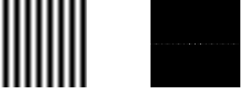

(Vertical sinusoidal)

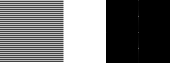

The above figures, we can observe that FT of pure sinusoidal images have a single component, represented by two bright spots symmetrically placed about the center.

 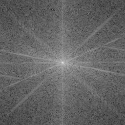

The FT of cameraman image is as shown as above. Notice that image that is shown in right are magnitude spectrum of FT.

**Frequency domain filtering:**

In this section, we show some filtering effects in frequency or Fourier domain. Frequency domain filtering takes an image and  a filter function in the Fourier domain. This image is then multiplied with the filter function in a pixel-by-pixel fashion:

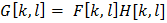

Where G ,F and H are Fourier transforms of the filtered image, input image and filter respectively. To obtain the resulting image in the spatial domain, G[k,l] has to be re-transformed using the IDFT. Here are some examples for frequency domain filtering. First we discuss about Low-pass filtering.

  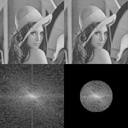 

The first and second images are the original and FT of lena image respectively. Third image is obtained by multiplying the complex Fourier image with an image containing a circle of radius 50 pixels. After applying IDFT on the third image, we get rightmost image, which is a lowpass filtered image of input image.

Similarly, Highpass filtered image can be obtained by suppressing the value at DC in Fourier image as shown below.

  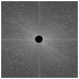 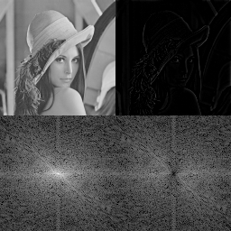